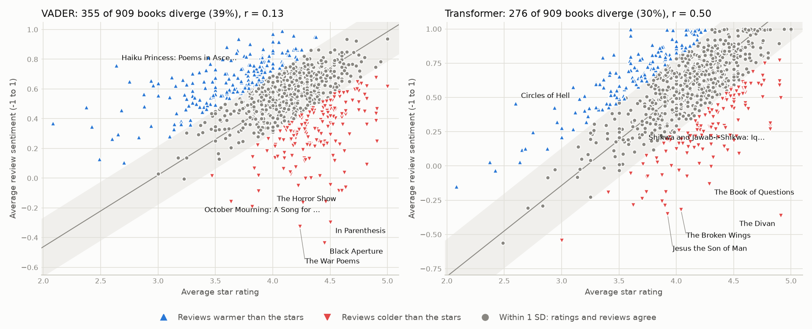
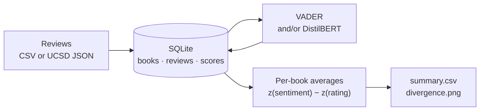

# Goodreads Reviews Sentiment Analyser

Finds books whose star ratings and written reviews disagree, by scoring review text with VADER and a transformer and comparing it with the stars.



## How it works



1. **Load** reviews (book, stars, text) from a CSV or from the [UCSD Goodreads dataset](#larger-run-ucsd-goodreads-poetry).
2. **Score** each review from −1 (negative) to +1 (positive): with [VADER](https://github.com/cjhutto/vaderSentiment) (lexicon and rules) or [DistilBERT SST-2](https://huggingface.co/distilbert/distilbert-base-uncased-finetuned-sst-2-english) (a fine-tuned transformer; score = P(positive) − P(negative)). Scores are cached in SQLite per review and model, so re-runs only score new reviews.
3. **Compare** per book: average star rating vs average sentiment. The two are on different scales and each model is biased (VADER leans positive, the transformer saturates near ±1), so both are standardised across the books in the run:

   **divergence = z(sentiment) − z(rating)**

   A book **diverges** when |divergence| ≥ 1 standard deviation: its reviews read noticeably warmer (+) or colder (−) than its stars, relative to the other books. Ratings are the reviewers' own stars when the data has them, otherwise the book's published average.

## Quick start

Needs [uv](https://docs.astral.sh/uv/getting-started/installation/).

```bash
git clone https://github.com/sriharish252/Goodreads-Reviews-Sentiment-Analyser && cd Goodreads-Reviews-Sentiment-Analyser
uv run analyse --input data/sample_reviews.csv --books data/sample_books.csv
uv run --extra transformer analyse --input data/sample_reviews.csv --books data/sample_books.csv --model both
uv run pytest
```

The second command adds the transformer (downloads PyTorch and a 270 MB model the first time) and compares both models side by side. Results go to `out/summary.csv` and `out/divergence.png`; paths and the model are set by environment variables listed in [.env.example](.env.example).

## Larger run: UCSD Goodreads poetry

The [UCSD Book Graph](https://cseweb.ucsd.edu/~jmcauley/datasets/goodreads.html) has 15M Goodreads reviews, each with the reviewer's own stars. It is for academic, non-commercial use and must not be redistributed, so this repo includes only the loader and aggregate results. Download the poetry subset (77 MB) and run:

```bash
mkdir -p data/raw && cd data/raw
curl -LO https://mcauleylab.ucsd.edu/public_datasets/gdrive/goodreads/byGenre/goodreads_reviews_poetry.json.gz
curl -LO https://mcauleylab.ucsd.edu/public_datasets/gdrive/goodreads/byGenre/goodreads_books_poetry.json.gz
cd ../.. && uv run --extra transformer analyse --input data/raw/goodreads_reviews_poetry.json.gz --books data/raw/goodreads_books_poetry.json.gz --model both
```

It keeps English-language books with at least 10 rated reviews and uses up to 50 per book. VADER takes about a minute; the transformer about 80 minutes on a laptop CPU (5 reviews a second). Scores are cached, so re-runs take under a minute.

> Mengting Wan, Julian McAuley. [Item Recommendation on Monotonic Behavior Chains](https://mengtingwan.github.io/paper/recsys18_mwan.pdf). RecSys 2018.
> Mengting Wan, Rishabh Misra, Ndapa Nakashole, Julian McAuley. [Fine-Grained Spoiler Detection from Large-Scale Review Corpora](https://mengtingwan.github.io/paper/acl19_mwan.pdf). ACL 2019.

## Results

909 poetry books and 23,895 reviews from the UCSD run above:

| Model | Books that diverge | Rating vs sentiment, r |
|---|---|---|
| VADER | 355 (39%) | 0.13 |
| Transformer | 276 (30%) | 0.50 |

Per review, the two models agree on polarity 79% of the time (r = 0.40).

- **VADER mistakes the subject for the opinion.** Its most divergent books are war and elegy poetry: *Black Aperture*, *In Parenthesis*, *The War Poems*, *October Mourning*. A 5-star review calling a book "a powerful and moving reminder of a horrible crime" scores −0.89 with VADER and +1.00 with the transformer, which drops *October Mourning* and *Black Aperture* from its list and ranks the war anthologies at about −1.6 SD instead of −5.
- **Both models flag low-rated books with mild reviews**, such as *Wet Moments* and *Ronit & Jamil* (about 2 stars): polite disappointment like "I liked the pictures but I did not connect with the poetry" reads warmer than the stars it comes with.
- **Limits.** The language filter applies to the edition, not the review: the transformer's top result, Hafiz's *The Divan*, is mostly reviewed in transliterated Persian, which it scores at random. Reviews longer than 512 tokens are cut.

**The share that diverges mostly restates r.** Divergence is the difference of two standardised scores, so its spread is √(2 − 2r): the better a model's sentiment tracks the stars, the fewer books pass 1 SD (about 32% at r = 0.5 for normally distributed scores). Which books diverge, and why, is the useful output.

**Compared with the original finding.** The first version of this project judged by hand that 20% of a handful of books had misrepresented star ratings. On 909 books with a stated method, the transformer flags 30%. The two aren't directly comparable: different books, and a relative threshold in place of a manual judgement.

## Stack

Python 3.12 · uv · VADER · Hugging Face Transformers (DistilBERT) · SQLite · matplotlib · pytest · ruff · GitHub Actions

```text
src/goodreads_sentiment/
  cli.py       analyse command
  loaders.py   CSV and UCSD readers
  db.py        SQLite schema and the only code that touches the database
  scorers.py   VADER and transformer scorers
  analysis.py  per-book divergence
  chart.py     the scatter plot
```
